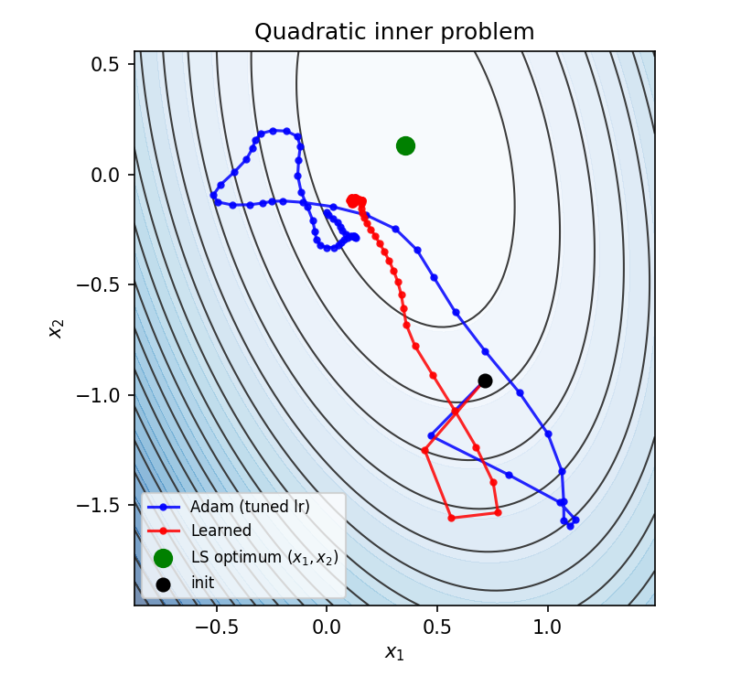
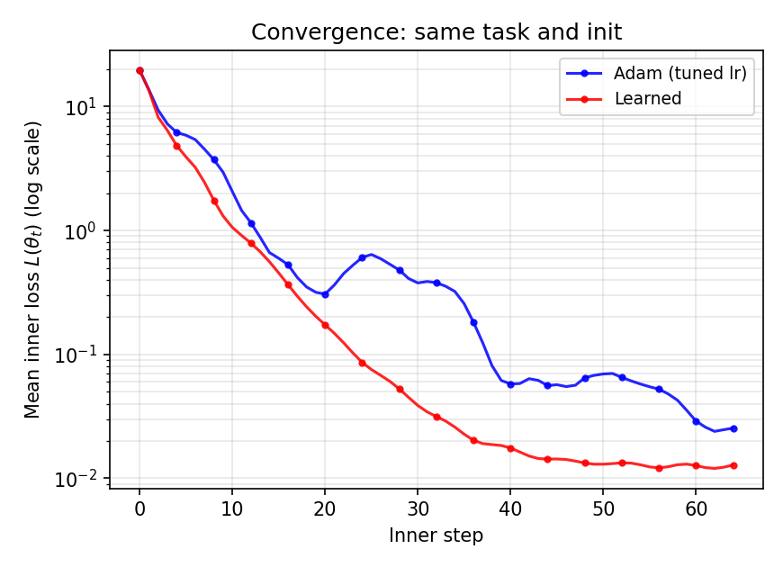
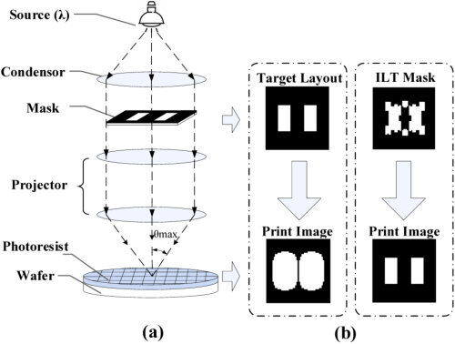
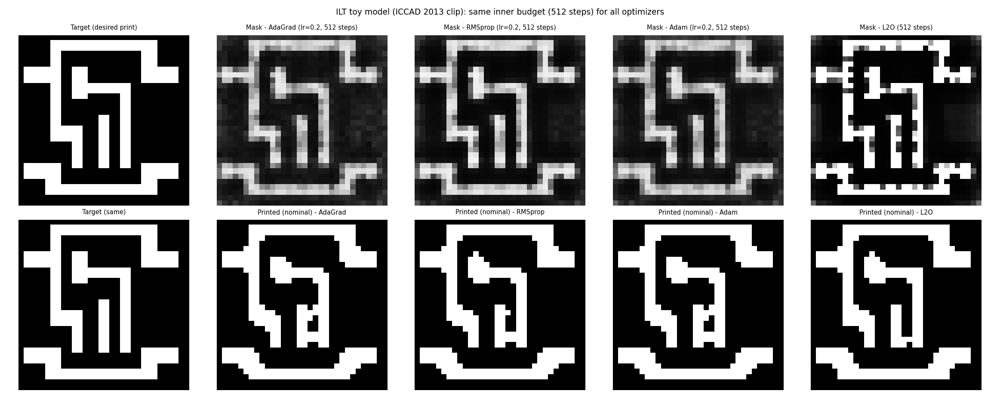

# Learning-to-optimize: a minimal example

This repo explains the concept of **learning-to-optimize** with a couple of simple demonstrations.

---

## 1. Learning to optimize (L2O): background and main ideas

### 1.1 Background

Formally, an **optimization task** is a pair $(\Theta, L)$ where $\Theta \subseteq \mathbb{R}^{d}$ is a parameter domain and $L:\Theta\to\mathbb{R}$ is an **objective function**. The goal is to compute
```math
\theta^\star \in \arg\min_{\theta\in\Theta} L(\theta).
```

Let $\mathcal{T}$ be a distribution over optimization tasks $i$. Each task is specified by $(\Theta_i,L_i)$ with $\Theta_i\subseteq\mathbb{R}^{d_i}$ and $L_i:\Theta_i \to \mathbb{R}$. The goal of each task is to approximate $\arg\min_{\theta\in\Theta_i}L_i(\theta)$.

An **optimizer** $F$ is a (possibly stateful) map that defines iterates
```math
(\theta_{t+1},h_{t+1}) = F\!\left(\theta_t, h_t, \nabla L_i(\theta_t), L_i(\theta_t), t \right),
```
where $h_t$ is optimizer state (*e.g.* moments in Adam). Classical optimization methods, such as *gradient descent*, *BFGS*, or *Adam*, specify $F$ **analytically** with **fixed** hyperparameters.

In L2O, $F$ is parameterized by $\phi$, where $\phi$ is **meta-trained** over $i \sim \mathcal{T}$ to minimize expected optimization error. The motivation is that shared structure across tasks can be captured in $\phi$, yielding update rules that may transfer better than a single fixed analytic rule.


### 1.2 L2O as meta-learning: inner vs outer optimization

For task $i\sim\mathcal{T}$ with $(\Theta_i,L_i)$, the **inner** problem is
```math
\min_{\theta\in\Theta_i} L_i(\theta).
```
The learned optimizer is a parametric stateful map $F_\phi$ that defines the trajectory

```math
(\theta_{t+1}, h_{t+1}) =
F_\phi\!\left(\theta_t, h_t, \nabla L_i(\theta_t), L_i(\theta_t), t\right),
```

where $h_t$ is optimizer state. Some optional conditioning is also included in the inputs to $F_\phi$. 

The **meta-objective** is a functional of the induced inner trajectory, typically a weighted sum of per-step losses:
```math
\mathcal{J}(\phi)=\mathbb{E}_{i\sim\mathcal{T}}\!\left[\sum_{t=0}^{T-1}\alpha_t\,L_i(\theta_t)\right].
```

Since $(\theta_t,h_t)$ depend on $\phi$ through $F_\phi$, the **outer** problem is to minimize $\mathcal{J}(\phi)$ via stochastic task sampling. In simple terms, we encourage a learned optimizer to follow an optimization trajectory with low values of the objective $L_i$. The lowest possible loss would be achieved if the optimizer found the global minimum in one step and then stayed there.

This repo implements meta-training of **neural optimizers** (`OptimizerNeural*` in `l2o/models.py`) on batches of problem-specific **optimizee** tasks (`problems/*/optimizee.py`). To this end, it uses a mean inner loss over unrolled steps with *truncated backpropagation through time* (BPTT).

See [(Andrychowicz *et al.*)](https://arxiv.org/abs/1606.04474) for more details.


### 1.3 Example of a hand-crafted optimizer: Adam

Let us look at the Adam optimizer to see how it fits into the framework introduced above. Adam maintains moment estimates $m_t, v_t$ and updates them as follows:

```math
m_t = \beta_1 m_{t-1} + (1-\beta_1)\, g_t, \qquad
v_t = \beta_2 v_{t-1} + (1-\beta_2)\, g_t \odot g_t,
```

with $g_t = \nabla L_i(\theta_t)$.

With the notation above, the update rule for the optimized parameters $\theta$ is:
```math
\theta_{t+1} = \theta_t - \alpha \frac{m_t}{\sqrt{v_t} + \varepsilon}.
```

Adam uses optimizer state $h_t = \{m_t, v_t, t\}$, and a fixed parameter vector $\phi_{\mathrm{adam}} = \{\alpha, \beta_1, \beta_2, \varepsilon\}$, so its transition can also be written in the general form introduced earlier. Thus, Adam is an analytic, non-learned instance of the same stateful-map template.

In L2O, in contrast, $\phi$ is optimized from task data rather than fixed a priori.


### 1.4 Learned optimizers

A central design question in L2O is how to represent $F_\phi$ so it scales to high-dimensional $\theta$. A fully dense parameter-coupled network over all coordinates is expressive, but its cost and data requirements typically grow poorly with dimension and can overfit to specific problem sizes.

A **coordinate-wise** architecture applies the **same** network to each coordinate $j$ of $g_t$, optionally with **per-coordinate** hidden state, so the computational complexity scales gently with $d$. Also, this approach naturally supports variable-size optimizees. This weight-sharing bias is often a good trade-off between expressivity and generalization, especially when many coordinates have similar local update statistics.

This repo uses stacked LSTM cells with **log-encoded** gradients $\mathrm{concat}(\log|g_j|, \mathrm{sign}(g_j))$, objective $\log L$, and normalized step, as inputs - see `l2o/models.py` (`OptimizerNeuralCoordinatewiseGradEnc`).

---

## 2. 2D demo: quadratic functions

### 2.1 Least squares

For each task, let $A \in \mathbb{R}^{m \times d}$, $b \in \mathbb{R}^m$. The optimizee implements

```math
L(\theta) = \tfrac{1}{2}\,\lVert A\theta - b \rVert_2^2
\quad\Rightarrow\quad
\nabla L(\theta) = A^\top (A\theta - b).
```

Meta-training samples random $(A, b)$ and trains a neural optimizer to find minima of the corresponding objectives.


### 2.2 Results

We compare **Adam** (with learning rate chosen on a **separate** random quadratic) to the **meta-trained learned** optimizer. 

The trajectory plot shows $(\theta_1, \theta_2)$ for an **8-dimensional** $\theta$ and the **least-squares optimum** in that plane (green marker), with **filled level sets** of $L(\theta)$ in the $(x_1, x_2)$ slice with $x_3,\ldots,x_8$ fixed to the optimum.

<p align="center">

</p>

<p align="center">

</p>

See `l2o_example.ipynb` for a playground.

---


## 3. L2O for inverse lithography

### 3.1 Background

**Inverse Lithography Technology** (ILT) is a photomask optimization technique in semiconductor manufacturing that calculates mask shapes needed to produce a desired wafer pattern. 

The forward lithography chain is often written schematically as
```math
M \;\xrightarrow{\text{optics}}\; \text{aerial intensity} \;\xrightarrow{\text{resist}}\; \text{printed image } Z.
```
with $\mathbf{M}$ denoting a mask.

During this process, the high-frequency components of the diffracted mask image are lost, causing a blurred version of the mask image at the imaging (wafer) plane.

<p align="center">

</p>

Classical ILT seeks a mask whose forward lithography response matches a **target** layout $Z$. With a **forward model** $g$ (optics + resist), one may write the idealized problem as finding $\mathbf{M}^\star$ such that $g(\mathbf{M}^\star) \approx Z$, while controlling variation across conditions.
```math
\mathbf{M}^\star \approx g^{-1} (Z).
```

There is generally **no closed-form** solution for $g^{-1}$, so practical solvers use iterative optimization algorithms on a pixelized or parameterized mask. 


### 3.2 Hopkins optical model

Under the **Hopkins** approximation, partially coherent imaging can be written as a **sum of coherent systems** (SOCS): a quadratic form in the mask spectrum. In the spatial domain, a common scalar abstraction is a **sum of squared convolutions** or a weighted sum of blurred mask intensities:

```math
I_{\mathrm{nom}}(\mathbf{x}) = \sum_{k=1}^{K} w_k \,\bigl\lvert (h_k * M)(\mathbf{x}) \bigr\rvert^2 ,
```

where $h_k$ are **kernel** functions, $*$ is convolution, and $w_k \ge 0$. 

**Process conditions** (*e.g.* nominal / max / min defocus) use slightly different kernels $h_k^{(\mathrm{nom})}, h_k^{(\max)}, \ldots$, giving images $I_{\mathrm{nom}}, I_{\mathrm{max}}, I_{\mathrm{min}}$ for robustness analysis.


### 3.3 Resist model

A simple **sigmoid resist** model maps aerial intensity to a **printed** value in $[0,1]$:

```math
Z(\mathbf{x}) = \sigma\bigl(\gamma\,(I(\mathbf{x}) - \tau)\bigr),
```

with gain $\gamma > 0$ and threshold $\tau$.


### 3.4 ILT objective 

Given a **target** layout image $Z^\star$ (binary or soft), ILT minimizes a sum of fidelity and robustness terms, *e.g.*

```math
\mathcal{L}_{\mathrm{ILT}}(M)
= \underbrace{\big\lVert Z_{\mathrm{nom}}(M) - Z^\star \big\rVert_2^2}_{\text{L2 fidelity}}
\;+\;
\lambda_{\mathrm{PV}}\,
\underbrace{\big\lVert Z_{\max}(M) - Z_{\min}(M) \big\rVert_2^2}_{\text{PV-band proxy}},
```

`ILTOptimizee` in `problems/ilt/optimizee.py` flattens mask logits $\mathbf{x} \in \mathbb{R}^{HW}$, sets $M = \sigma(\mathbf{x})$, applies a tiny **SOCS-style** `SimplifiedLitho` (Gaussian kernels + sigmoid resist), and returns per-batch **mean** squared error plus a **PV** penalty.


### 3.5 L2O for ILT

A recent line of work combines **L2O** with **ILT**. The L2O-ILT framework from [(Zhu *et al.*)](http://www.cse.cuhk.edu.hk/~byu/papers/J103-TCAD2024-L2ILT.pdf) **unrolls** the **iterative ILT optimization** into a **learnable neural network**, motivated by the general L2O paradigm. 

L2O-ILT adopts ILT-specific structure in the network so that it can output a high-quality initial mask amenable to fast refinement, improving both mask printability and runtime relative to hand-crafted algorithms, such as gradient descent.

The present codebase is a minimal L2O demo, and **not** a reimplementation of the solution from the paper. 

---

## 4. ILT demo

Note: This repo uses a toy SOCS litho in `ILTOptimizee`, not full industrial simulation.

**Main trainer:** `scripts/train_ilt_l2o.py` meta-trains on **synthetic ICCAD-style `.glp`** files under `data/synthetic_glp_train/` by default (see Quick-start to generate them).

**ICCAD eval clips** are stored only under `benchmarks/iccad2013/` (not under `data/`).

**Architecture:** `scripts/train_ilt_l2o.py` uses **`gradenc`** only - `OptimizerNeuralCoordinatewiseGradEnc` (two LSTM layers per coordinate) in `l2o/models.py`.

The eval script tunes AdaGrad, RMSprop, and Adam learning rates on a small subset of training layouts, then runs the same inner-step budget for every optimizer on each ICCAD clip. Reported **L2** and **PVB** follow the **LithoBench** protocol: bilinear upsampling to **2048x2048** and **binarization** at 0.5.

<p align="center">

</p>


### 4.1 Benchmark metrics

Columns are **binarized** L2 / PVB at `eval_size` (LithoBench-style), not the smooth training-time MSE. Numbers below match **`checkpoints/ilt_l2o.pt`** from default **`scripts/train_ilt_l2o.py`** (synthetic `.glp` training), with LR tuning on **`data/synthetic_glp_train`** via `--tune-glp-dir`.

| Optimizer | Mean total $\mathcal{L}$ | Mean L2 (bin., $2048 \times 2048$) | Mean PVB (bin.) |
|-----------|---------------------------|------------------------|-----------------|
| AdaGrad (tuned lr) | 0.044 | 0.041 | 0.039 |
| RMSprop (tuned lr) | 0.040 | 0.037 | 0.039 |
| Adam (tuned lr) | 0.043 | 0.040 | 0.038 |
| Learned optimizer | **0.037** | **0.034** | 0.040 |

Here $\mathcal{L} = \mathrm{L2} + \lambda_{\mathrm{PV}}\,\mathrm{PVB}$ uses the **reported** (binarized, upsampled) L2 and PVB terms from `ilt/eval/metrics.py`, with the same $\lambda_{\mathrm{PV}}$ as `ILTOptimizee` in `problems/ilt/optimizee.py`.

### 4.2 Discussion

On these **mean** ICCAD benchmark numbers (L2O meta-trained on **synthetic** ICCAD-style `.glp`, ICCAD-only eval), the README checkpoint improves **total $\mathcal{L}$** and **mean L2** versus tuned AdaGrad, RMSprop, and Adam at grid **32** with **512** inner steps; mean PVB can trade off against L2 via $\lambda_{\mathrm{PV}}$. Results depend on the synthetic generator, train/val split, and unroll; see `scripts/train_ilt_l2o.py`.


---

## Quick-start: training and evaluation

**Environment setup**
```bash
python -m pip install -r requirements.txt
```

**Download ICCAD `.glp` eval clips** (stored under `benchmarks/iccad2013/`)
```bash
get_benchmarks.sh
```

**Generate synthetic ILT training clips** (ICCAD-style `.glp`; default input directory for `scripts/train_ilt_l2o.py`)
```bash
python scripts/prepare_ilt_training_data.py synthetic --n 256 --out data/synthetic_glp_train --seed 42
```
Skip this if `data/synthetic_glp_train/` already has enough `synth_train_*.glp` files for training. 

**Train a learned optimizer on quadratic objectives**
```bash
python scripts/train_quadratic_l2o.py
```

**Train a learned optimizer on ILT** (synthetic `.glp` by default; writes `checkpoints/ilt_l2o.pt`)
```bash
python scripts/train_ilt_l2o.py --out checkpoints/ilt_l2o.pt
```

**Evaluate on the ICCAD benchmark** (use **`--grid 32`** to match the default checkpoint)
```bash
python scripts/eval_ilt_benchmark_table.py --checkpoint checkpoints/ilt_l2o.pt --tune-glp-dir data/synthetic_glp_train --grid 32 --inner-steps 512 --eval-size 2048 --device cuda
```

**Regenerate README figures** (optional): `python scripts/gen_readme_figures.py` or `python scripts/gen_readme_figures.py --only-ilt` for the ILT comparison panel.


